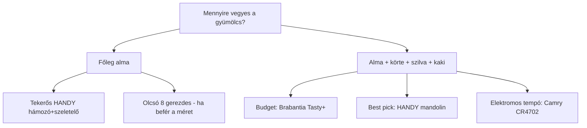

# Gyümölcsszeletelő / zöldség–gyümölcs szeletelő eszközök Magyarországon  
**Cél:** aszalás előtti gyors, egyenletes szeletelés (főleg alma, körte, szilva, datolyaszilva/kaki), tipikus adag **2–3 kg/alkalom**, szezonban akár **napi** használat.  
**Készült:** 2026. október 10.  
**Árkategóriák:** elsődleges 20–30 ezer Ft · másodlagos 30–40 ezer Ft · 40 ezer Ft felett külön prémium szekció.

---

## Fontos megjegyzések a kereséshez

- A keresőkben sok **„elektromos gyümölcsszeletelő”** találat **gyermekjáték** (elem, műanyag kés) – ezek **nem** alkalmasak 3 kg feldolgozásra.
- A **3 kg teljes idő** = előkészítés (mosás, selejtezés, nagy gyümölcs félbevágása, magozás) + tényleges szeletelés + köztes ürítés/tisztítás. Ahol nincs gyártói adat, **becslés**, és a táblázatban jelezve.
- **Aszaláshoz** általában **3–6 mm** vékony, egyenletes korong/gerezd a ideális; a fix **8–12 gerezdes almaszeletelő** gyors, de vastagabb szeleteket ad (aszalás idő hosszabb, de használható).
- **Puha** gyümölcsnél (érett kaki, nagyon érett szilva) minden fogazott pengés gép **tapadhat**; segít a **hűtés**, a **firmebb fogyasztási érettség**, vagy **kézi mandolin**.
- Használt hirdetések **gyorsan elköthetők**; az árak és linkek **pillanatkép** – vásárlás előtt mindig ellenőrizd az elérhetőséget.

---

## Pontozási módszer (1–10 skála)

| Dimenzió | Mit nézünk |
|----------|------------|
| **Ár-érték** | Teljesítmény a feladatra / ár (beleértve a rejtett időt: adagolás, tisztítás). |
| **Szeletelési sebesség** | 3 kg-ra vetített gyakorlati tempó. |
| **Egyenletesség** | Aszalásra alkalmas, hasonló vastagság. |
| **Tisztíthatóság** | Szétszedés, pengék, mosogatógép. |
| **Tartósság** | Anyag, márka, szezonális intenzív használat tűrése. |
| **3 kg alkalmasság** | Folyamatos munka megszakítás nélkül (kapacitás, túlmelegedés, adagoló). |

**Összesített pontszám** = szabályos átlag a fenti 6 dimenzióból (egyen súly). Az **ár-érték** oszlop csak az ár-érték dimenziót mutatja.

---

## Rangsorolt összehasonlító táblázat

| Termék | Új/használt | Ár (Ft, kb.) | Kézi/elektromos | Kapacitás / teljesítmény | 3 kg becsült feldolgozási idő* | Szeletvastagság | Tisztítás | Fő előny | Fő hátrány | Ár-érték | Összesített | Vásárlási link |
|--------|-------------|--------------|-----------------|--------------------------|--------------------------------|-----------------|-----------|----------|------------|----------|-------------|----------------|
| **Tescoma HANDY mandolin** zöldség–gyümölcs | Új | 29 445 | Kézi | Asztali mandolin, 9 fokozat | **14–20 perc** | ~1–9 mm (9 fokozat) | Közepes; DG nem | Univerzális (alma, körte, szilva, kaki), állítható vastagság aszaláshoz | Nagyobb hely; kézvédő kell; kaki puha lehet | 8,5 | **8,4** | [Pepita](https://pepita.hu/kezi-szeletelok-c5237/tescoma-handy-mandolin-zoldsegszeletelo-p19746741) · [Tescoma HU](https://www.tescoma.hu/handy-mandolin-zoldseg-szeletelo) |
| **Brabantia Tasty+** multifunkciós (4 betét) | Új | 12 487 | Kézi | 4 cserélhető penge | **16–24 perc** | Vékony + vastag szelet (2 betét) | Jó; tartó; DG (egyes részek) | Erős ár/teljesítmény a 20–30k sáv alatt; kompakt | Nincs finom fokozatozás mint HANDY; kisebb tartó | **9,0** | 8,2 | [Modov](https://modov.hu/multifunkcios-szeletelo-tasty-brabantia-8710755145469/) |
| **Börner Vital Mandolin Basic Set** | Új | 21 190 | Kézi | 4 vastagság + ételfogó | **12–18 perc** | 4 vastagság | Közepes | Gyors V-mandolin, éles acél, magyar forgalmazó | Ár a felső sávban; kaki/ puha szilva óvatosan | 8,0 | 8,3 | [Börner HU](https://boerner.hu/en/product/borner-vital-mandolin-basic-set/) |
| **OXO Good Grips mandolin** 35,5 cm | Új | 17 960 | Kézi | 3 vastagság + julienne | **14–20 perc** | 1,5 / 3 / 6 mm + julienne | Közepes | Megbízható minőség, jó fogó | Drágább mint Brabantia; keskenyebb munkafelület | 7,5 | 8,0 | [KitchenShop](https://www.kitchenshop.hu/oxo-mandolin-szeletelo-355-x-114-x-136-cm) |
| **Westmark 5162** almaszeletelő (8 gerezd) | Új | 3 190 | Kézi | max. ~9 cm átm. alma/körte | **8–14 perc** (ha befér) | Fix gerezd (~8 db) | Nagyon könnyű; DG | Olcsó, gyors alma/körte, magház kivágás | Nem állítható vastagság; nagy alma/körte/kaki gyakran **nem fér**; szilva nehéz | 8,0 | 7,0** | [Pepita](https://pepita.hu/kezi-szeletelok-c5237/westmark-5162-almaszeletelo-8-reszes-9-cm-atmerovel-p30861433) |
| **PRESTO / Tescoma** almaszeletelő | Új | 2 490 | Kézi | 8 gerezd, DG | **8–14 perc** | Fix gerezd | DG | Mosogatógép; 3 év garancia | Ugyanaz mint Westmark típus korlátai | 8,5 | 7,1 | [PlazaMAX → pepita](https://plazamax.hu/termek/presto-almaszeletelo.html) |
| **Leifheit 03157** almaszeletelő (12 rész) | Új | 4 590–6 885 | Kézi | 12 gerezd | **9–15 perc** | Fix, vékonyabb gerezd | Közepes | Finomabb gerezd mint 8-as | Max méret korlát; univerzális gyümölcsre gyenge | 7,5 | 7,2 | [Diomi](https://www.diomi.hu/leifheit-almaszeletelo/) · [Árukereső](https://reszelo-szeletelo.arukereso.hu/leifheit/alma-szeletelo-leifheit-03157-p1309136494/) |
| **Tescoma HANDY almahámozó + szeletelő** (tekerős) | Új | 15 105–17 645 | Kézi | Spirál szelet + hámozás | **10–16 perc** (csak **alma**) | Spirál szelet (~3–5 mm jelleg) | Öblítés; **nem DG** | Gyártó szerint **aszaláshoz** ajánlott; hámozás egyben | Főleg **alma**; körte/szilva/kaki más eszköz | 8,0 | 7,8*** | [OtthonElektronika](https://otthonelektronika.hu/arak/tescoma-handy-almahamozo-es-szeletelo) · [4home](https://www.4home.hu/tescoma-handy-almahamozo-es-szeletelo/) |
| **HORECATECH HA045** kézi almaszeletelő | Új | ~2 743 (br.) | Kézi | 12 gerezd, 9 cm | **9–15 perc** | Fix | Szétszedhető | Rozsdamentes; vendéglátós minőség | 9 cm korlát; recés oldal nem aszalás | 7,0 | 7,0 | [Gammo](https://gammo.hu/horecatech-kezi-almaszeletelo-ha045) |
| **Camry CR 4702** elektromos szeletelő | Új | 23 350–26 220 | Elektromos | **400 W**, Ø190 mm kés | **12–18 perc** + esetleg szünet | **0–15 mm** | Levehető kocsi, közepes | Erős ár a 400 W-hoz; nagy kés, állítható vastagság | Puha gyümölcs csúszhat; zaj; folyamatos üzem limit (nincs publik. 5 perc szabály, de kisebb motor melegedhet) | 8,5 | **8,2** | [Pepita](https://pepita.hu/szeletelo-gepek-c1924/camry-cr-4702-400w-0-15mm-ezust-szeletelogep-p10525070) · [Easy-Shop](https://www.easy-shop.hu/food-slicer-camry-cr-4702.html) |
| **Sencor SFS 1001GR** elektromos szeletelő | Új | 11 690–15 490 | Elektromos | **100 W**, Ø170 mm | **15–22 perc** | **1–15 mm** | Levehető alkatrészek | Olcsó **asztali** szeletelő, összecsukható | Gyengébb motor; puha gyümölcs; 100 W = lassabb tempó | 8,0 | 7,9 | [Árukereső](https://www.arukereso.hu/szeletelogep-c4169/sencor/sfs-1001gr-p163536944/) · [Pepita](https://plazamax.hu/termek/sencor-sfs1001gr-100-w-1-15-mm-feher-zold-elektromos-szeletelo.html) |
| **Zelmer ZFS0916** (S) elektromos | Új | 17 600–25 590 | Elektromos | **150 W**, Ø170 mm | **14–20 perc** | **0–15 mm** | Levehető tálca | Hasonló osztály, jól ismert márka HU-n | Hússzeletelő jelleg; gyümölcs tapadás; készlet változik | 7,5 | 7,8 | [Megatrend/Árukereső](https://www.megatrend.hu/termek/zfs0916.html) |
| **SilverCrest SAS 120 E1** (Lidl típus) | Új | 23 990–29 080 | Elektromos | **120 W**, max ~23 mm | **16–24 perc** (+ **5 perc** max folyam. üzem) | Fokozatmentes ~23 mm-ig | Levehető kés | RSG Solingen penge; összecsukható | **5 perc** folyamatos limit 3 kg-nál zavaró lehet; gyümölcs nem elsődleges | 7,0 | 7,5 | [DepoHáz](https://depohaz.hu/silvercrest-elektromos-szeletelo-120w-kenyer-es-hus-szeletelo-sas-120-e1-131134) · [eMAG](https://www.emag.hu/silvercrest-sas-120-e1-elektromos-univerzalis-elelmiszer-szeletelo-kenyer-kolbasz-sajt-es-zoldseg-etel-konnyu-vagasahoz-120w-t-sas-120-e1-szeletelogep-120w/pd/D8NFP6YBM/) |
| **Sencor SSG 4300WH** (álló, 5 betét) | Új | 13 989–17 990 | Elektromos | **150 W**, 56 mm betöltő | **22–30 perc** | ~0–10 mm jelleg (betétenként) | Betétek cseréje, mosás | Olcsó elektromos „saláta” szeletelő | **Kis betöltő**; sok aprítás előtte; 3 kg-ra **lassú** összidő | 6,5 | 6,8 | [Pepita](https://pepita.hu/szeletelogepek-c1924/sencor-ssg-4300wh-elektromos-szeletelo-ertekcsokkentett-p31066335) · [eMAG](https://www.emag.hu/sencor-elektromos-szeletelo-5-fele-szeleteles-150w-feher-ssg-4300wh/pd/DTDLH7YBM/) |
| **MOSMAOO WJ302** elektromos reszelő/szeletelő | Új | 24 944 | Elektromos | **300 W**, **0,5 l** tál | **35–50 perc** | 5 penge (vastag/közepes) | Levehető penge | Olcsó 300 W papíron | **0,5 l kapacitás** = állandó ürítés; nem 3 kg-os adagra | 4,0 | 5,5 | [eMAG](https://www.emag.hu/elektromos-reszelo-mosmaoor-300-w-5-kulonbozo-penge-elektromos-zoldsegszeletelo-rozsdamentes-acel-konnyen-hasznalhato-csendes-fekete-wj302/pd/DR0PK03BM/) |
| **Használt: Börner V3** (Aukro/CZ) | Használt | licit + szállítás | Kézi | 6 vágási mód | **12–18 perc** | Több betét | Közepes | Pro mandolin olcsón | Külföldi szállítás; állapot változó | 8,5 | 8,0 | [Aukro példa](https://aukro.hu/gyumolcs-es-zoldsegaprito-borner-v3-7125368360) |
| **Használt: elektromos szeletelő** (Siemens MS 2020 típus) | Használt | ~3 000–8 000 | Elektromos | ~100 W | **15–25 perc** | folyamatos állítás | Kés levehető | Nagyon olcsó prémium márha | Kor, kopás, garancia nincs | 7,5 | 7,0 | [Vatera példa (elkelt)](https://www.vatera.hu/elektromos-szeletelogep-siemens-elado-3518103869.html) · [Jófogás keresés](https://www.jofogas.hu/magyarorszag?q=szeletel%C3%B6) |
| **Használt: almaszeletelő** Jófogás | Használt | 1 000–2 000 | Kézi | 8 gerezd típus | **8–14 perc** | fix | könnyű | Kísérlet / tartalék eszköz | Ismeretlen minőség | 9,0 | 6,5 | [Jófogás példa](https://www.jofogas.hu/fejer/Almaszeletelo___gyumolcsvago_161508040.htm) |

\* **Becsült teljes munkafolyamat-idő** közepes almára/körtére/szilvára, aszalas vastagságra állítva (mandolin/electric 4–6 mm), egy fő, gyakorlott tempó.  
\*\* Univerzális gyümölcsre alacsonyabb, **tiszta alma/körte** munkára ~7,8.  
\*\*\* Csak alma-domináns napokra magasabb (~8,5).

---

## Futottak még / prémium alternatívák (40 000 Ft+)

| Termék | Ár (Ft, kb.) | Miért kerül ebbe a sávba | 3 kg idő (becslés) | Megéri-e a felár? |
|--------|--------------|---------------------------|--------------------|-------------------|
| **Ritter Fino 1** | 50 583–72 310 | Német fémház, 65 W Eco, 0–20 mm, Ø170 | **10–15 perc** | Igen, ha **évente sok száz kg** gyümölcs és hosszú élettartam kell |
| **Ritter Markant 05** | ~30 497–33 962 | Összecsukható, 65 W, 0–14 mm | **12–17 perc** | Közepes; Markant 05 közelebb a 40k sávhoz |
| **Ritter Germany Fino 1** (eMAG) | ~50 583 | Ugyanaz | **10–15 perc** | [eMAG](https://www.emag.hu/ritter-germany-fino-1-elektromos-szeletelo-allithato-vastagsag-0-20-mm-fogazott-penge-o-170-mm-univerzalis-biztonsagi-rendszer-oko-motor-elelmiszerhulladek-minimalizalas-gyujtotalca-mellekelve-ezust-2/pd/D721Z6MBM/) |
| **Börner Vital Pro Set** | ~43 548 | Teljes mandolin készlet | **10–16 perc** | Csak ha kocka/julienne is kell |
| **Hendi Profi Line** zöldség–gyümölcs robot | 100 000+ | **550 W**, ipari, 24 kg | **5–8 perc** | Kisüzemi / nagy volumen, nem háztartási |
| **Tupperware Mandolin** (új/hirdetés) | ár egyeztetés | 0–9 mm, sok formátum | **14–20 perc** | Ha már van TW csatorna; [Jófogás](https://www.jofogas.hu/bekes/Tupperware_Mandolin_Szeletelo_161237057.htm) |

---

## Használt piac – hol érdemes nézni

| Forrás | Mit találsz | Tipikus ár | Megjegyzés |
|--------|-------------|------------|------------|
| [Jófogás „szeletelő”](https://www.jofogas.hu/magyarorszag?q=szeletel%C3%B6) | almaszeletelő, HANDY mandolin, Sencor SFS, Ritter | 1 000–25 000 | Foxpost/MPL gyakori |
| [Vatera szeletelőgépek](https://www.vatera.hu/listazas.php?text=szeletel%C5%91g%C3%A9p) | Severin, Siemens, multifunkciós | 3 000–20 000 | Ellenőrizd pengét |
| [Aukro.hu](https://aukro.hu) | Börner, Ritter új/használt CZ/SK | változó | Szállítás + garancia |
| Facebook Marketplace | „szeletelőgép”, „mandolin”, „almaszeletelő” | 5 000–30 000 | Helyi átvétel előny |

**Használt vételnél:** pengék egyenessége, tálca/play, biztonsági kapcsoló, motor hangja (elektromos), és hogy **gyümölcsöt** már próbáltak-e rajta (kenyér/hús pengék gyakran kopottabb).

---

## Gyümölcsönkénti rövid útmutató

| Gyümölcs | Jól működik | Figyelem |
|----------|-------------|----------|
| **Alma** | Mandolin, almaszeletelő, tekerős HANDY hámozó, elektromos szeletelő | Nagy alma: félbevágás mandolinnál; gerezdes szeletelő: max átmérő |
| **Körte** | Mandolin, erős gerezdes (ha befér) | Puha fajta: vékony szelet, lassabb |
| **Szilva** | Mandolin (félbe, magozás) | Nagyon érett: elektromos gép szétcsúsztathatja |
| **Kaki / datolyaszilva** | Mandolin, éles kés | Csak **keményebb** állapot; puha kaki → kézi kés vagy vastagabb szelet |
| **Egyéb szezonális** | Mandolin univerzális | Mindig próba szelet 2–3 db gyümölccsel |

---

## Részletes termékjegyzetek (kivonat)

### Tescoma HANDY mandolin (~29 445 Ft)
- **Előkészítés:** nagy gyümölcsöt félbe; magozás külön (kivéve almaszeletelő típusok).
- **Tisztítás:** szétszedhető; **mosogatógép nem** (gyártó).
- **Garancia:** 3 év.
- **3 kg:** folyamatos tolás ételfogóval; egyenletes 4–6 mm aszaláshoz ideális beállítás.

### Camry CR 4702 (~23 350–26 220 Ft, 400 W)
- **Folyamatos üzem:** nincs explicit 5 perces limit a leírásban, de **400 W** háztartási gép – 3 kg-nál tervezz **1–2 rövid szünetet** puha gyümölcsnél.
- **Penge:** levehető, 0–15 mm.
- **Tisztítás:** nyomólap/tálca levehető.

### Sencor SFS 1001GR (~11 690–15 490 Ft, 100 W)
- **Előny:** állítható vastagság, kompakt tárolás.
- **Hátrány:** gyengébb motor → hosszabb **teljes** idő 3 kg-ra, mint Camry.

### MOSMAOO WJ302 – **nem ajánlott 3 kg-ra**
- **0,5 l** kapacitás és álló reszelő logika → folyamatos ki/be pakolás; aszalás előtti batch-hez rossz arányban áll.

### Tescoma HANDY almahámozó + szeletelő (~15–17 ezer Ft)
- Gyártói szöveg: **nagyobb mennyiség hámozatlan alma aszaláshoz**.
- **Spirál** szelet ≠ korong, de aszalásra sokaknak beválik.
- **Körte/szilva/kaki:** más eszköz kell.

---

## Ajánlások – összefoglaló

### 1. Legjobb olcsó választás (20–30 ezer Ft)
**Tescoma HANDY mandolin (~29 445 Ft)** – ha a felső határ belefér: egy eszköz az egész gyümölcsportfóliára, állítható vastagság aszaláshoz.  
Ha **szigorúan 20 000 alatt** kell maradni: **Brabantia Tasty+ (~12 487 Ft)** + meglévő kés magozáshoz, vagy **Börner Vital Basic (~21 190 Ft)**.

### 2. Legjobb ár-értékű választás
**Brabantia Tasty+ multifunkciós (~12 487 Ft)** – a pontozás szerint is erős ár-érték; a teljes 3 kg idő mandolinnal összehasonlítható, de olcsóbb belépés.  
**Második hely:** **Camry CR 4702**, ha az elektromos tempó fontosabb és ~26 ezer Ft elfogadható.

### 3. Legjobb elektromos választás 40 ezer Ft alatt
**Camry CR 4702 (400 W, ~23–26 ezer Ft)** – legjobb egyensúly teljesítmény / ár / állítható vastagság.  
Alternatíva olcsóbban: **Sencor SFS 1001GR (~12–15 ezer Ft)**, ha vállalod a lassabb **össz** időt és a 100 W-os motort.

### 4. Legjobb használt vétel
**Börner V3 / V5 mandolin** (Aukro/Jófogás, ~8–25 ezer Ft + szállítás), jó állapotban – ugyanaz a feladat, mint új mandolinnál, fele áron.  
**Elektromos:** **Sencor SFS 1001** vagy **Siemens/Ritter** használt hirdetés 5–15 ezer Ft körül – **mindig** próba szeletelés vagy friss penge.

### 5. Legjobb prémium alternatíva
**Ritter Fino 1 (~54–72 ezer Ft)** – fémház, finom vastagság 0–20 mm, hosszú élettartam intenzív szezonra. Megéri, ha a olcsóbb gépeket már elhasználnád/kopatnád 5–10 szezon alatt.

### 6. Mit vennék a ti felhasználásotokra – és miért?
**Elsődleges: Tescoma HANDY mandolin (~29 ezer Ft)**  
Indok: vegyes gyümölcs (alma, körte, szilva, kaki), **napi 2–3 kg**, aszalas **vastagság állítás**, hosszú élettartam, szezonon kívül kis helyen tárolható. A **3 kg teljes idő** (~14–20 perc) realisztikus és jóval kevesebb, mint késsel, miközben nem kell 40 ezer feletti gépre kötni magatokat.

**Kiegészítés (opcionális):** ha az alma adja a bulk 70%-át, **Tescoma HANDY almahámozó + szeletelő (~15–17 ezer Ft)** – ez viszi a legrosszabb részt (hámozás + spirál) az almáról; körte/szilva/kaki marad a mandolinnál.

**Nem venném első eszköznek:** MOSMAOO WJ302 (túl kicsi tál), SSG 4300 (túl sok adagolás), olcsó 8 gerezdes almaszeletelő **egyedül** (szilva/kaki/nagy alma frusztráció).

---

## Gyors döntési fa

---

## Források és frissítés

Árak webshopok és árösszehasonlítók **2026. október eleji** pillanatképei (Pepita, eMAG, Árukereső, Modov, Kulina, Börner HU, Jófogás, Vatera). Vásárlás előtt ellenőrizd a **szállítási díjat** és a **jótállást**.

**Kapcsolódó fájlok a repóban:** `trees/fruit/` (ültetvény / fajták kontextus).
