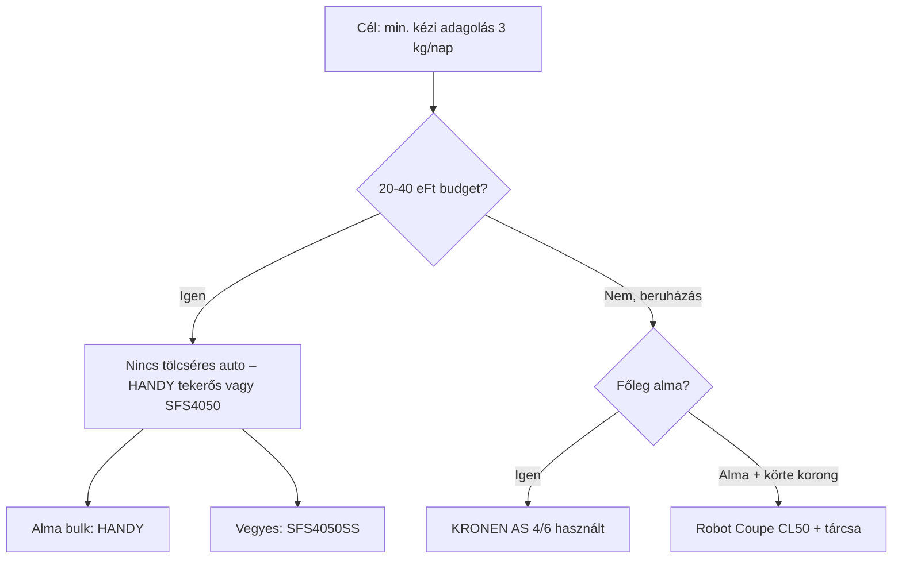

# Gyümölcsszeletelő kutatás – **automatizálás és kézi adagolás** szempontból  
**Kérdés:** *Melyik eszközzel lehet 2–3 kg almát/körtét a **legkevesebb emberi munkával** feldolgozni aszaláshoz?*  
**Készült:** 2026. október 10.  
**Kapcsolódó:** [első, általános összehasonlítás](gyumolcsszeletelo-aszalashoz-kutatas.md)

---

## Executive summary – a lényeg egy mondatban

**20–40 ezer Ft között Magyarországon jelenleg nincs olyan háztartási gép, amelybe több almát/körtét betöltesz, és a gép automatikusan, egyenként továbbítaná őket a vágóegységhez (C/D kategória).**  
Ebben az ársávban legfeljebb **B kategória** érhető el: gyümölcsönként **egy bedobás / egy felhelyezés**, esetleg kevesebb részművelet (hámozás+magozás+szeletelés egy lépésben).  
A **valódi automata adagolás** kisüzemi/ipari gépeknél kezdődik (Robot Coupe tölcsér, KRONEN AS, M.F.T. MW-R2, AHB-1500 stb.), jellemzően **néhány száz ezer – több millió Ft**.

---

## Adagolási kategóriák (A–D)

| Kategória | Jellemző | 3 kg alma (~20 db) – hozzányúzások becslése* |
|-----------|----------|-----------------------------------------------|
| **A** | Minden gyümölcsöt kézzel a késhez/pengéhez igazítasz, nyomsz | **40–80+** (fogás + nyomás + újra) |
| **B** | Egyenként bedobás / kocsira / tüske – a **vágás** automatikus vagy egy karral | **18–35** |
| **C** | **Tölcsér/garat**: egyszerre sok gyümölcs, te csak nyomókar / plunger | **3–12** |
| **D** | Automata szalag, orientálás, gyakorlatilag csak töltés és felügyelet | **1–5** (tételenként) |

\*Becslés: mosás/selejtezés nélkül, csak a szeletelőhöz kapcsolódó érintések. A **kezelői idő** külön oszlopban.

---

## Pontozás (1–10)

- **Automatizáltság:** mennyire megy magától a gyümölcs a vágófelé (C/D magas).
- **Kézi beavatkozás (10 = minimális munka):** fordított logika – 10 = kevés érintés, 1 = minden almát külön kézzel vágás.

**Végső rangsor súlya:** automatizáltság + kézi beavatkozás + ár/érték (háztartási realitás) + 3 kg-ra vetített **kezelői idő**.

---

## Rangsor – automatizálás-centrikus táblázat

| # | Termék | Új/haszn. | Ár (Ft) | A–D | Automat. | Kézi munka (10=max) | Betölthető egyszerre | Auto adagolás | Minden almát külön megfogni? | Külön a késhez nyomni? | 3 kg kezelői idő* | 3 kg teljes idő* | Egyenletesség | Tisztítás | Fő előny | Fő hátrány | Link |
|---|--------|-----------|---------|-----|----------|---------------------|----------------------|---------------|------------------------------|-------------------------|-------------------|------------------|---------------|-----------|----------|------------|------|
| 1 | **Robot Coupe CL50 Ultra** + szeletőtárcsa | Új | ~740k–940k + tárcsák | **C** | 9 | **9** | tölcsér: sok alma/körte (max ~75×170 mm nyílás) | Igen (folyamatos tölcsér + nyomókar) | Nem (tölcsérbe rakod) | Nem (kar nyomja) | **~4–7 perc** | ~8–12 perc | Nagyon jó (tárcsától) | Közepes, szétbontható | Legjobb **háztartáson kívül still realistic** tölcséres megoldás HU-n | Ár, súly (~20 kg), tárcsa külön, körte puha lehet | [Piliskonyha](https://piliskonyha.hu/CL50-Ultra-Robot-Coupe-Zoldsegszeletelogep) |
| 2 | **KRONEN AS 4** (használt ipari) | Haszn. | ár kérésre (Exapro) | **B→C** | 8 | **8** | 3 alma párhuzamosan | Részleges (automata tűzés után) | Igen, de **bedobásos** (nem késhez nyomás) | Nem | **~5–8 perc** | ~10–14 perc | Kiváló gerezd/szelet | Ipari tisztítás | Kis asztali ipari alma-gép | Alma/körte Ø55–85 mm; szűrő; nehéz beszerzés | [Exapro AS4](https://www.exapro.hu/kronen-as-4-p251127177/) |
| 3 | **KRONEN AS 6** | Új | ~millió+ (ajánlat) | **B→C** | 8 | **8** | 3 egyszerre feldolgozás | Részleges / automata betöltés | Bedobás | Nem | **~4–7 perc** | ~8–12 perc | Kiváló | Ipari | 900 alma/óra, hámoz+magoz+szelet | 163 kg, 6 bar levegő, nem háztartási | [KRONEN](https://www.kronen.eu/en/solutions/apple-peeling-and-slicing-machine-as-6) |
| 4 | **M.F.T. MW-R2** (használt sor) | Haszn. | ár kérésre | **D** | **10** | **10** | közös táplálótartály | **Igen** | Nem (tartály/szalag) | Nem | **~2–4 perc** | ~5–8 perc | Ipari | Ipari | Valódi automata orientálás+adagolás | Ipari méret/ár, nem 40k sáv | [Kitmondo](https://www.kitmondo.com/hu/mft-mw-r2-p260211076/) |
| 5 | **AHB-1500** almahámozó (kisüzemi) | Haszn. | ~1,95 M Ft + ÁFA | **B** | 6 | 7 | 1 tüskén | Részleges | Igen (tüskére) | Nem | ~8–12 perc | ~12–18 perc | Hámozás, nem vékony korong | Közepes | Alma/körte hámoz+csutka | **Nem szeletel aszaló korongra** alapból | [Agroinform](https://www.agroinform.hu/aprohirdetes_adatlap/gep/elelmiszeripari-gepek/ahb-1500-almahamozo/h_7603112) |
| 6 | **Tescoma HANDY almahámozó + szeletelő** | Új | 18 400 | **B** | 5 | **7** | 1 db (tüske) | Nem | Igen (ráfűzés) | Nem (tekerő) | **~7–11 perc** | ~10–15 perc | Spirál/korong jelleg, aszaláshoz bevált | Öblítés, nem DG | **3 az 1-ben**: hámoz+magoz+szelet – kevesebb *művelet*/alma | Alma-centrikus; körte nehezebb; **nem** tölcsér | [Tescoma](https://www.tescoma.hu/handy-almahamozo-es-szeletelo) |
| 7 | **Westmark almahámozó-szeletelő** | Új | 10 990 | **B** | 5 | 6 | 1 | Nem | Igen | Nem (tekerő) | ~8–12 perc | ~11–16 perc | Hasonló HANDY-hoz | Kézi | Olcsóbb alternatíva tekerősre | Körte/szilva gyengébb | [Weninger](https://befozoautomata.hu/termekek/Westmark/Almahamozo-szeletelo-gep/) |
| 8 | **Sencor SFS 4050SS** | Új | 25 549–28 990 | **A→B** | 4 | **6** | 1 a kocsin | Nem | Igen (kocsi) | **Igen** (kocsit tolod) | ~9–14 perc | ~12–18 perc | Jó korong (1–15 mm) | Levehető részek | **Körte/alma** állítható vastagság; kényelmesebb mint mandolin | **Még mindig almánként/kézenként adagolsz**; nem tölcsér | [Sencor](https://www.sencor.hu/elektromos-szeletelo/sfs-4050ss) · [Árukereső](https://www.arukereso.hu/szeletelogep-c4169/sencor/sfs-4050ss-p344604126/) |
| 9 | **Camry CR 4702** | Új | 23 350–26 220 | **A→B** | 4 | 5 | 1 kocsi | Nem | Igen | Igen | ~9–14 perc | ~12–17 perc | Jó | Közepes | Erősebb motor mint SFS1001 | Ugyanaz: kézi adagolás | [Pepita](https://pepita.hu/szeletelo-gepek-c1924/camry-cr-4702-400w-0-15mm-ezust-szeletelogep-p10525070) |
| 10 | **Sencor SSG 4300WH** | Új | 13 989–17 990 | **B** | 3 | 5 | 1×56 mm nyílás | Nem | Igen (bedobás) | Nem (csak bedobod) | ~12–18 perc | ~18–25 perc | Közepes | Betétcserék | Olcsó, bedobós | Kis nyílás; lassú **össz**idő 3 kg-ra | [Pepita](https://pepita.hu/szeletelogepek-c1924/sencor-ssg-4300wh-elektromos-szeletelo-ertekcsokkentett-p31066335) |
| 11 | **KitchenAid / nagy konyhai robot** (Exact Slice, 3,1 l) | Új | ~100k+ | **C?** | 5 | 6 | tölcsér: több kisebb gyümölcs | Részleges (plunger) | Plungerrel | Nem közvetlenül | ~8–13 perc | ~12–18 perc | Közepes–jó | Robot mosás | Széles adagolócső | Drága; alma méret limit; nem dedikált aszaló workflow | [eMAG példa](https://www.emag.hu/konyhai-robotgep-3-1l-kitchenaid-5kfp1325ewh/pd/DL3KPSBBM/) |
| 12 | **Tescoma HANDY mandolin** | Új | 29 445 | **A** | 2 | 3 | 1 | Nem | Igen | Igen (tologatás) | ~14–20 perc | ~18–25 perc | Jó | Közepes | Univerzális gyümölcs | **Sok kézi adagolás** – rossz választás adagolás-célra | [Pepita](https://pepita.hu/kezi-szeletelok-c5237/tescoma-handy-mandolin-zoldsegszeletelo-p19746741) |
| 13 | **Westmark/PRESTO 8 gerezdes** | Új | 2 490–3 190 | **A** | 2 | 4 | 1 | Nem | Igen | Igen (nyomás) | ~6–10 perc | ~8–14 perc | Gerezd (fix) | Könnyű | Gyors **egy** nyomás/alma | Max ~9 cm; sok fogás; nem auto | [Pepita Westmark](https://pepita.hu/kezi-szeletelok-c5237/westmark-5162-almaszeletelo-8-reszes-9-cm-atmerovel-p30861433) |
| 14 | **Pelamatic elektromos hámozó** (Jófogás) | Haszn. | ~25 500 | **B** | 4 | 5 | 1 tüske | Nem | Igen | Nem (gomb) | ~10–15 perc | ~12–18 perc | Hámozás, **nem** aszalo szelet | Könnyű | Hámozás automatizált | **Nem szeletel** egyenletes korongra | [Jófogás](https://www.jofogas.hu/hajdu_bihar/Pelamatic_professzionalis_elektromos_citrus_hamozo_161101461.htm) |
| 15 | **Kis kereskedelmi JME100 / TPP-XP1** (import) | Új | ~300–800k becslés | **C** | 8 | 8 | tölcsér | Igen | Bedobás | Nem | ~5–8 perc | ~8–12 perc | Ipari alma gerezd | Ipari | „Mini” automata hámoz+magoz+szelet | Garancia/szerviz HU-n gyenge | [Joy JME100](https://www.joywasher.com/commercial-apple-peeler-corer-slicer-machine/) |

\* **Becslés**, közepes alma (~150 g), ~20 db ≈ 3 kg. Kezelői idő = aktívan a gyümölccsel / adagolóval dolgozol.

---

## Külön válasz: létezik-e 20–40 ezer Ft-os „tölcséres automata”?

**Nem.** A magyar webshopok és használtpiac (Jófogás, Vatera, eMAG, Pepita, MediaMarkt) **2026. októberi** keresése alapján:

| Amit találsz 20–40k között | Valójában mi ez | Automatizálás |
|----------------------------|-----------------|---------------|
| Sencor SFS 4050SS / Camry CR4702 | Asztali **hússzeletelő jellegű** gép | **A→B**: kocsi + kéz tolja át a pengén |
| Sencor SSG 4300WH | Álló reszelő, 56 mm-es nyílás | **B**: bedobod, de **minden** gyümölcs külön |
| „Elektromos spirál almahámozó” (Aliexpress jellegű) | 1 db tüskés hámozó | **B**, gyakran gyenge minőség |
| Livington TurboCut stb. | Kézi tolás pengéhez | **A** |
| Tescoma HANDY tekerős | 1 alma / fordulat | **B**, de **nem** tölcsér |

**Következtetés:** 20–40 ezer Ft-ban a **sweet spot** = **kevesebb művelet almánként** (tekerős hámozó+szeletelő), **nem** kevesebb alma kézbevétele.

---

## Legolcsóbb *valóban* automatikusabb alternatívák (összehasonlításhoz)

| Megoldás | Tipikus ár (Ft) | Adagolás | Megjegyzés |
|----------|-----------------|----------|------------|
| Használt **KRONEN AS 4** | százas ezrek–? | 3 párhuzamos slot | Alma/körte Ø55–85 mm, ~35 kg |
| **Robot Coupe CL50** + 2–4 mm szelet tárcsa | ~850k–1,1M + tárcsa | Nagy tölcsér | Alma **félbe** vagy kisebb; körte óvatosan |
| **M.F.T. MW-R2** használt | több M Ft | Szalag + tartály | Aszalóipari |
| **AHB-1500** | ~2 M Ft | Tüskés félautomata | Főleg **hámozás**, nem vékony szelet |
| **Kis import automata almagép** (JME100 class) | ~400–800k becslés | Tölcsér | Szállítás, szerviz kockázat |

---

## Hússzeletelő / univerzális elektromos szeletelő almára?

| Modell | Adagolás típus | Aszalásra alkalmas szelet? | Megéri-e adagolás miatt? |
|--------|----------------|----------------------------|---------------------------|
| **Sencor SFS 4050SS** | Kocsi, 190 mm penge | Igen, 1–15 mm korong | **Igen (40k alatt)**, de **nem** csökkenti érdemben az almák számát |
| **Camry CR4702** | Hasonló | Igen | Igen, ha körte is kell; adagolás ugyanaz |
| **Sencor SFS 1001GR** | Kisebb kocsi | Igen | Olcsóbb, több kézidő |
| **SilverCrest SAS 120** | Kocsi, 5 perc limit | Igen | Adagolás szempontból **nem** jobb, limitál |

**Biztonság:** mindig **ujjvédő / kocsi**; puha körte tapad – hűtés, firmebb fogyasztási érettség.

---

## Használt piac – automatizálás szempontból

| Forrás | Mit érdemes keresni | Ár jelleg |
|--------|---------------------|-----------|
| [Agroinform / agrár gépek](https://www.agroinform.hu) | almahámozó, AHB, gyümölcsfeldolgozó | 400k–2M+ |
| [Exapro gyümölcs gépek](https://www.exapro.hu/ps-used-fruit-processing-machines/) | KRONEN, M.F.T. | ár kérésre |
| [Jófogás „almahámozó”](https://www.jofogas.hu/magyarorszag?q=almah%C3%A1moz%C3%B3) | tekerős, spirál | 3–25k (**B**, nem tölcsér) |
| [Jófogás „Robot Coupe”](https://www.jofogas.hu/magyarorszag?q=robot+coupe) | ritka használt CL50 | ~300–700k ha felbukkan |

---

## Mit **nem** érdemes adagolás-célra venni (de „elektromos”)

- **MOSMAOO WJ302** – kis tál, minden darab külön bedobás (**A**).
- **Mandolin / Börner** – kiváló szelet, de **A** kategória.
- **8 gerezdes almaszeletelő** – gyors nyomás, de **minden alma külön** (**A**).

---

## Konkrét válasz a felhasználói kérdésre

> *Ha a helyedben lennék, évente néhány héten keresztül napi ~3 kg almát/körtét szeletelnél aszaláshoz, melyik gépet venném, ha a cél az egyenkénti kézi adagolás megszüntetése?*

**Őszinte válasz:** a **20–40 ezer Ft-os háztartási sávban ezt a célt nem lehet teljesíteni.**  
A reális stratégia kétlépcsős:

1. **Szezonra (most):** minimalizálni a *műveletek számát* almánként → **tekerős hámozó+szeletelő**.
2. **Ha tényleg tölcsér kell:** használt **Robot Coupe CL50** (+ szeletőtárcsa) vagy használt **KRONEN AS 4** – ez már szándékos beruházás.

---

## 3 konkrét ajánlás (a kért formátumban)

### 1. Legjobb **20–30 ezer Ft** körül (adagolás szempontból reális maximum)

**Tescoma HANDY almahámozó és szeletelő (~18 400 Ft)**  
- **Link:** [tescoma.hu/handy-almahamozo-es-szeletelo](https://www.tescoma.hu/handy-almahamozo-es-szeletelo)  
- **Mit spórol meg:** külön **hámozás, magozás, kézi szeletelés** – almánként **1 felhelyezés + tekerés** (~20–25 mp), nem 3–5 perc kézi munka.  
- **Mit nem spórol meg:** továbbra is **~20 érintés/3 kg**; **körte/szilva** gyengébb.  
- **Kategória:** **B** (nem tölcsér).

*Alternatíva olcsóbban:* Westmark almahámozó-szeletelő ~10 990 Ft ([Weninger](https://befozoautomata.hu/termekek/Westmark/Almahamozo-szeletelo-gep/)).

---

### 2. Legjobb **30–40 ezer Ft** körül

**Sencor SFS 4050SS (~25 549–28 990 Ft)** – *körte + alma*, állítható vastagság  
- **Link:** [sencor.hu SFS 4050SS](https://www.sencor.hu/elektromos-szeletelo/sfs-4050ss)  
- **Mit spórol meg:** mandolinnal szemben **nincs késhez nyomkodás**, stabil kocsi, gyors vágás **darabonként**.  
- **Mit nem spórol meg:** **minden (fél)almát külön a kocsira** teszel – **~15–22 adag** / 3 kg; **A→B**, **nem** automata tölcsér.  
- **Automatizálás vs HANDY:** alma workflow-ban a HANDY **kevesebb munkafázis**; SFS4050 **jobb körte/univerzális korong**.

*Ha főleg alma:* maradj HANDY-nál. *Ha vegyes:* SFS4050SS.

---

### 3. Legjobb automatikus / prémium (árérzékenység nélkül)

**Robot Coupe CL50 Ultra + vékony szeletelő tárcsa (2–4 mm)**  
- **Link:** [Piliskonyha CL50](https://piliskonyha.hu/CL50-Ultra-Robot-Coupe-Zoldsegszeletelogep) (~730k Ft + ÁFA + tárcsák)  
- **Mit spórol meg:** **tölcsérbe töltés** – 3 kg almát **1–3 adagban** betöltöd, a gép **nyomókarral** adagol; **nem** almánként késhez nyomsz (**C**). Kezelői idő ~**4–7 perc**/3 kg.  
- **Hátrány:** ár, hely, súly, tisztítás; nagy alma **félbe**; puha körte problémás.  

**Második hely (almára specializáltabb):** használt **KRONEN AS 4** – bedobásos, 3 párhuzamos alma, hámoz+magoz+szelet egy gépen ([Exapro](https://www.exapro.hu/kronen-as-4-p251127177/)).

**Ipari referencia (nem háztartás):** **M.F.T. MW-R2** – teljes automata szalag + orientálás ([Kitmondo](https://www.kitmondo.com/hu/mft-mw-r2-p260211076/)).

---

## Döntési összefoglaló

---

## Források

Sencor gyártói leírás (SFS 4050SS adagolókocsi méretek), Tescoma HANDY, Robot Coupe / KRONEN / M.F.T. gyártói és használtgép-portálok, magyar webshop árak 2026. október – részletek az [első kutatásban](gyumolcsszeletelo-aszalashoz-kutatas.md).
