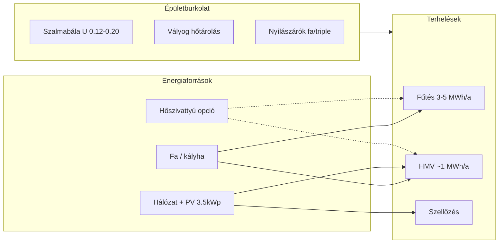

# Szalmabála ház – épületgépészeti és energetikai kutatás

**Projekt:** Horváth Péter & Horváth-Csiki Andrea – Kömlőd, hrsz. 383/384  
**Dokumentum típusa:** döntéstámogató kutatás (nem tervezői műszaki terv)  
**Készült:** 2026-10-01  
**Forrás prompt:** `szalmahaz-gepeszet.md`  
**Projektadatok:** `szalmahaz.md`  
**Bizonyosság-jelölés:** 🟢 magas | 🟡 közepes | 🔴 alacsony / becslés

---

## 1. Executive Summary

A Kömlődön tervezett **~50–60 m²** hasznos alapterületű, **szalmabála + fa pallóváz + vályog** kis lakóépület **rendkívül alacsony fűtési igényű** épületnek számít. A becsült **tervezési fűtőteljesítmény ~2,2–2,6 kW** (MSZ EN 12831 jellegű becslés, −13 °C külső), éves térmelegítési igény **~3,1–5,1 MWh/év** (használati mód és szellőzés függvényében).

**Központi megállapítások:**

1. **Az épületfizika megelőzi a gépészeti döntést:** a hőveszteség ~**38%-a** a szellőzés/infiltráció (🟡). Légtömörség + célzott szellőzés gyakran többet ér, mint egy extra réteg szigetelés.
2. **A projektgazdák tömegkályha + csikótűzhely hipotézise műszakilag illeszkedik** az alacsony csúcsterheléshez és a hőtároló tömeghez (vályog + kályha), de **nem bizonyított optimális** minden üzemmódhoz (hétvégi vs állandó).
3. **A meglévő ~3,5 kWp PV + ~12 kWh akku** (szigetüzem, 🟡 a pontos topológia a repo-ban nincs dokumentálva) **nem alkalmas fűtésre** a projekt szándéka szerint; áramszünetre **nem elektromos fűtés** a robusztus irány.
4. **Hat rendszerkoncepció** került kidolgozásra; **egyetlen „helyes” válasz nincs** – a választás a **9/10 önellátási prioritás**, **45 M Ft teljes költségkeret**, **hétvégi → állandó** használat és **karbantarthatóság** között mozog.
5. **Google Drive mellékletek** (térképek, alaprajzok, szintvonal) **ehhez a futáshoz nem voltak hozzáférhetők** → tájolás, pontos nyílászáró felület és szennyvíz szintvonal **részben feltételezés**.

---

## 2. Projekt és követelmények

| Tétel | Adat | Bizonyosság |
|--------|------|-------------|
| Építtetők | Horváth Péter, Horváth-Csiki Andrea | 🟢 |
| Telek | Kömlőd, hrsz. 383 (út, közmű) + 384 (építési cél, telekrendezés folyamatban) | 🟢 |
| Övezet | (Lt)-1: max 30% beépítettség, 4,5 m magasság, min 40% zöld | 🟡 (dokumentum duplikált idézet) |
| Hasznos alapterület | 45–60 m² (1+1 nappali **vagy** 2+1 nappali) | 🟢 |
| Költségkeret (teljes épület) | 45 000 000 Ft | 🟢 |
| Ütemezés | 2026 tervezés, 2027 pince+szerkezet, 2028 lakható | 🟢 |
| Használat | Először hétvégi/nyaraló → idővel állandó | 🟢 |
| Szerkezet | Pallóváz, szalmabála, vályog; látszó RL gerendás födém | 🟢 |
| Pince | ~60 m²: gomba (~30), növény (~10), gépészet száraz (~10), tároló (~10) | 🟢 |
| Fűtés (preferencia) | Központi tömegkályha + csikótűzhely; hőleadó: klíma **vagy** padlófűtés (nyitott) | 🟢 |
| HMV | Elektromos bojler; napkollektor később | 🟢 |
| Szennyvíz | Csatorna utcában; száraz/komposzt WC + gyökérzóna/Greenwater érdekel | 🟢 |
| PV/akkumulátor (telek) | ~3,5 kWp + ~12 kWh, szigetüzem, nem fűtésre | 🟡 (gepeszet prompt, nincs a szalmahaz.md-ben) |
| CSOK | Nem | 🟢 |
| Akadálymentesség | Nem követelmény | 🟢 |
| Önellátás prioritás | ~9/10 (prompt) | 🟡 |

**Ellentmondások / tisztázandó:**

- **383 vs 384:** az épület helye a Drive térképek alapján pontosítható; jelenleg **feltételezés:** fő lakóépület a rendezett építési telken (384 felosztás után vagy 383-on).
- **Konyha „külön helyiség: nem”** vs **„nyitott konyha”** → egy légtér konyha+nappali (🟢).
- **Max építménymagasság 4,5 m** vs **későbbi tetőtér-beépítés** → részleges tetőtér csak alacsony belmagasságú részekkel vagy engedélymódosítással (🟡).

---

## 3. Kiindulási adatok

### 3.1 Épületmodell (számítási alap)

| Paraméter | Érték | Típus |
|-----------|--------|--------|
| Hasznos alapterület | **55 m²** (számítás), 50–60 sáv | Feltételezés |
| Footprint | ~9,0 × 6,1 m, belmagasság 2,7 m | Feltételezés |
| Hőtároló tömeg | Vályog vakolat + fa födém + tömegkályha | Tervezett |
| Fal U | 0,12 / **0,16** / 0,20 W/m²K | Tartomány |
| Tető U | ~0,18 W/m²K | Feltételezés |
| Padló (pince fölött) | U ~0,32 W/m²K, pince ~10 °C | Feltételezés |
| Ablak | ~18% WWR, U~0,9 W/m²K | Feltételezés |
| Légcsere | n = 0,45–0,55 h⁻¹ (természetes); n~0,3 + HRV opció | Tervezési sáv |
| Éghajlat | Kömlőd, θe,des = −13 °C, HDD(20°C) ~2900–3300 | 🟡 MSZ 24140 jelleg |

### 3.2 Meglévő villamos rendszer (telek)

| Paraméter | Érték |
|-----------|--------|
| PV | ~3,5 kWp |
| Akkumulátor | ~12 kWh |
| Üzemmód | Szigetüzem (elsősorban általános fogyasztás) |
| Távolság új épülettől | Néhány méter – **átkötés / backup kábel** lehetséges |

---

## 4. Hiányzó adatok és feltételezések

### 4.1 Hiányzó / tisztázandó (döntésbefolyásoló)

| # | Kérdés | Miért számít |
|---|--------|--------------|
| 1 | Pontos épület tájolás, ablakfelületek tengelyenként | Nyári túlmelegedés, passzív hűtés |
| 2 | n50 / blower-door célérték | Hőigény, pára, HRV indokoltság |
| 3 | Pince födém szigetelése, talajvíz/szint | Pince klíma, gomba, gépészet korrózió |
| 4 | Kémény helye, átmérő, tűzvédelmi távolság szalmától | Tömegkályha vs biztonság |
| 5 | Hálózati csatlakozás az új épületnél (mérő, teljesítmény) | HP, bojler, együttes PV |
| 6 | Szennyvíz bekötés szintje a utcához képest (Drive térkép) | Gravitációs csatorna vs szivattyú |
| 7 | Tetőtér-beépítés időzítése és engedélyezhetősége | Hőhidak, fűtési zónák |

### 4.2 Google Drive hivatkozások

A `szalmahaz.md`-ben szereplő Drive linkek **nem lettek feldolgozva** (nincs automatikus hozzáférés). Érintett: alaprajzok, telekrajz, szintvonal, fotógyűjtemény.

---

## 5. Épületfizikai modell

### 5.1 Hőveszteség és H' (MSZ EN 12831 jellegű)

**Alapeset (U_fal=0,16 W/m²K, n=0,5 h⁻¹):**

| Komponens | Tervezési hőveszteség | Arány |
|-----------|----------------------|-------|
| Homlokzat + tető + padló | ~1267 W | ~62% |
| Szellőzés / infiltráció | ~833 W | ~38% |
| **Összesen Φ_design** | **~2200 W (2,2 kW)** | 100% |

**H' ≈ 67–79 W/K** (U_fal és n sávban).

### 5.2 Szalmabála + vályog – hőtechnikai viselkedés

| Jelenség | Hatás a gépészetre |
|----------|-------------------|
| Nagy λ-szigetelés (szalma) | Alacsony Φ_design; **nem** csökkenti automatikusan a szellőzési arányt |
| Vályog hőtárolás | Hétvégi üzem: lassú hűlés (τ ~1–3 hét nagy tömeggel); **komfort**, kevesebb ciklus |
| Pára | Szalma **csak szárazon** tartandó; diffúziónyitó rétegrend + szellőzés kritikus |
| Légtömörség | Károsabb a nedves szalma, mint az alulméretezett fűtés |

**Kutatási válasz (prompt §5):** egy hőtároló tömegű, jól szigetelt kis épület **2–3 kW csúccal** operálhat, míg egy hagyományos ~100 m² ház **8–15 kW**; a gépészet **kisebb teljesítmény**, de **pára- és szellőzés-komplexebb**.

---

## 6. Várható hőigény

| Üzemmód | Éves térmelegítés (nettó, sáv) | kWh/m²a | Megjegyzés |
|---------|-------------------------------|---------|------------|
| Állandó 20 °C | **4300–5100 kWh/a** | 79–93 | Alapeset |
| Hétvégi ház (12–14 °C hétköznap) | **3100–3400 kWh/a** | 56–62 | Projekt induló használat |
| + MVHR (η~75%) | **3000–4000 kWh/a** | 55–73 | Extra CAPEX |

**HMV (2 fő, zuhany, mosógép):** **800–1200 kWh/a** villamos energia (🟡).

**Felfűtési csúcs (hétvégi érkezés):** 14→20 °C rövid időn **+5–10%** pillanatnyi teljesítmény a statikus Φ_design felett (tömeg kisimít).

---

## 7. Fűtési technológiák – összehasonlító áttekintés

| Technológia | Illeszkedés ehhez az épülethez | Áramszünet | Önellátás | Megjegyzés |
|-------------|-------------------------------|------------|-----------|------------|
| **Tömegkályha + csikó** | **Kiváló** (alacsony kW, tömeg) | 🟢 | Fa helyi | Projekt hipotézis |
| Cserépkályha / kandalló | Jó | 🟢 | Fa | Kevesebb tárolás → hétvégi üzem gyengébb |
| Pellet kályha/kazán | Jó | 🟡 (automata) | Pellet szállítás | Alacsony karbantartás, függőség |
| Levegő–levegő HP | Jó gyors fűtésre | 🔴 | Hálózat/PV | COP télen változó |
| Levegő–víz HP | Túlméretezés veszély | 🔴 | Hálózat | Magas CAPEX kis házon |
| Elektromos (padló/panel) | Műszakilag jó | 🔴 | Hálózat | Rezsicsökkentett cap felett drága |
| Infrapanel | Gyors rásegítés | 🔴 | Hálózat | Nem főrendszernek ideális |

**Kizárt / gyenge indoklás nélkül nem javasolt:** nagy teljesítményű gázkazán (nincs gáz a telken, 🟢); teljes off-grid elektromos fűtés (akkukkal ellentétes cél).

---

## 8. Hőleadó rendszerek

| Hőleadó | Reakcióidő | Alacsony energiaigény | Áramszünet | Értékelés |
|---------|------------|----------------------|------------|-----------|
| Tömegkályha sugárzás | Lassú | **Kiváló** | 🟢 | Alap preferencia |
| Padlófűtés (víz) | Lassú | Jó | 🔴 (szivattyú) | HP-vel párosítható |
| Klíma (L-L HP) | Gyors | Jó (túlzás veszély) | 🔴 | Rásegítőnek erős |
| Radiátor | Közepes | Túlmérezhető | 🟡 | Kályhával működik |
| Természetes konvekció | Lassú | Jó | 🟢 | Low-tech |

---

## 9. Gyors rásegítő fűtés (30–120 perc)

**Kontextus:** átmeneti időszak (5–15 °C kint), napközben napsütés, esti rövid igény.

| Megoldás | Előny | Hátrány |
|----------|-------|---------|
| Csikótűzhely / sparhelt | Azonnali, önellátó, főzés | Pára, szellőzés |
| Tömegkályha „gyors adag” | Egységes rendszer | 30 perc alatt kevés |
| L-L HP 2–3,5 kW | Gyors | Áram, zaj, COP |
| Infrapanel 1–2 kW | Gyors, olcsó | Áram |
| Fatüzelés kisméretű | Önellátó | Füst, munka |

**Következtetés (🟡):** hétvégi üzemmel **a rásegítő gyakran opcionális**; állandó lakás + átmeneti szezonban **csikó + opcionális 1× L-L HP** vagy **2× infrapanel** a legkiegyensúlyozottabb.

---

## 10. HMV

| Megoldás | CAPEX (Ft) | OPEX | Áramszünet | Megjegyzés |
|----------|------------|------|------------|------------|
| Elektromos bojler 80–120 L | 80–200 e | 🟡 36/70 Ft/kWh | 🔴 | Projekt preferencia |
| Indirekt + kályha | +216–345 e tároló | Fa | 🟡 | Kémény mellett, karbantartás |
| Hőszivattyús bojler | 300–600 e | Alacsonyabb kWh | 🔴 | Komplex |
| Napkollektor (később) | 400–900 e | 🟢 | 🟡 | Tető orientáció kell |
| PV→bojler (Thor/relay) | +50–150 e | Nappali ingadozó | 🔴 | Kiegészítő |

**Javaslat a koncepciókban:** **1. fázis: villamos bojler**; **2. fázis: napkollektor vagy kályha-indirekt** ha a kémény és a hely adott.

---

## 11. Szellőzés

| Megoldás | CAPEX | Pára / szalma | Gombatermesztő pince |
|----------|-------|---------------|----------------------|
| Ablak + szelepek | Alacsony | 🟡 felhasználófüggő | Külön szükséges |
| Decentral HRV (2–4 db) | 400–900 e | Jobb | Nem helyettesíti pince szellőztetést |
| Központi HRV | 900 e – 1,6 M | **Legjobb** lakórész | Külön rendszer pincére |

**Kis alacsony igényű épületnél** a központi HRV **nem automatikusan gazdaságos** (🟡); **de** szalmánál a **célzott légminőség + pára** miatt **legalább fürdő/konyha + pince külön szellőztetés** erősen ajánlott.

---

## 12. Nyári hőterhelés és hűtés

**Passzív (elsődleges):** déli **8×3 m pergola + növényzet** (🟢 projekt), éjszakai szellőztetés, vályog csúcsterhelés elnyelése, túlzott déli üveg kerülése.

**Aktív hűtés igény becslés:** 🟡 **500–1500 kWh/a** hűtési energia (L-L HP-vel), ha nincs túl nagy déli üveg.

**Aktív hűtés csak akkor indokolt**, ha a Drive alaprajz **nagy déli üveget** mutat; egyébként **L-L HP hűtés melléktermék** lehet a gyors fűtés koncepcióban.

---

## 13. PV és elektromos rendszer

### 13.1 Meglévő rendszer képességei (becslés)

| Paraméter | Becslés | Bizonyosság |
|-----------|---------|-------------|
| Napi termelés (év átlag) | ~10–14 kWh | 🟡 |
| Téli napi termelés | ~2–6 kWh | 🟡 |
| 12 kWh akku | Világítás, hűtő, IT, szivattyúk **rövid** backup | 🟡 |
| Fűtésre közvetlenül | **Nem cél** | 🟢 (projekt) |

### 13.2 Új épület integráció

- **Külön mérő / almérő** az új lakóépületnek (🟡).
- **Backup kábel** a meglévő sziget rendszerből: **vészhelyzeti** konnektorok (HMV, hűtő **nem** vagy korlátozott).
- **PV bővítés:** csak **2. fázis**, ha állandó lakás + HP; **+3–5 kWp** irány (🟡).

---

## 14. Részleges off-grid működés

**Filozófia (projekt):** hálózaton kényelmes; áramszünetkor **fűtés maradjon**, nem létfontosságú fogyasztás lekapcsolható.

| Fogyasztó | Hálózati | Áramszünet | Megjegyzés |
|-----------|----------|------------|------------|
| Tömegkályha / csikó | N/A | 🟢 | Fő fűtés |
| HMV bojler | 🟢 | 🔴 / korlátozott | Akku nem elég |
| HRV | 🟢 | 🔴 leáll | Ablak szellőztetés |
| L-L HP | 🟢 | 🔴 | Leáll |
| Világítás LED | 🟢 | 🟡 akku | |
| Szennyvíz szivattyú | 🟢 | 🔴 | Gravitációs WC jobb |

---

## 15. Önellátás

**Prioritás ~9/10** → a **fa** és **passzív épület** a legerősebb pillér; **villamos** részleges (PV + hálózat); **szakember** (kémény, HP) függőség csökkentése.

Részletes térkép: **§ 44. táblázat** (dokumentum vége).

---

## 16. Komplexitás és redundancia

**Elv:** ésszerű redundancia, minimális felesleges automatika.

| Koncepció | Komponensek száma (relatív) | Hibapontok |
|-----------|----------------------------|------------|
| A – Pure low-tech | ⭐ | Kevés |
| B – Kályha + puffert | ⭐⭐ | Közepes |
| C – Kályha + L-L HP | ⭐⭐⭐ | Több |
| D – L-V HP + padló | ⭐⭐⭐⭐ | Sok |
| E – Kályha + nap HMV | ⭐⭐⭐ | Szezonális |
| F – Redundáns (kályha + pellet) | ⭐⭐⭐⭐ | Két tüzelő |

---

## 17. Ökológiai értékelés (rövid LCA logika)

| Forrás | Beágyazott energia | Üzem | Légszennyezés helyi | Javíthatóság |
|--------|-------------------|------|---------------------|--------------|
| Fa (helyi) | Alacsony | CO₂ semleges **fenntartott erdő esetén** | **PM2.5** kályhánál | 🟢 |
| Hálózati villamos | Közepes | CO₂ mátrix függő | Távoli | 🟡 |
| HP | Magas (ritka fémek) | Alacsony kWh | Nincs helyi | 🟡 |
| Pellet | Közepes | Használat tisztább | Alacsony | 🟡 |

**„Megújuló ≠ mindig ökológiaiabb”:** nagy akkumulátor-cserék és HP csere **életciklus** szempontból a **jó minőségű kályha + jó épület** mellett versenyképes lehet.

---

## 18. Gazdasági elemzés – közös paraméterek

**Diszkontráta (TCO NPV):** **3%/év** (🟡 – infláció/kamat feltételezés)  
**Élettartam:** 30 év épület; aktív komponensek cseréi külön  
**Villamos ár (OPEX):** **36 Ft/kWh** (kedvezményes sáv) / **70 Ft/kWh** (felette) – MVM/MEKH, 🟢  
**Tűzifa:** **30 000–34 000 Ft/erdői m³** (2026 H2, 5% ÁFA, állami erdő) – 🟢 forrás a kutatásban  
**Fa energia:** ~**1800 kWh/erdői m³** (20% nedvesség, 🟡)

**Éves faigény (4,0 MWh_hasznos, η=0,8):** ~**2,8 erdei m³/év** (állandó); hétvégi üzem ~**2,0–2,3 m³/év**.

---

## 19. Rendszerkoncepciók (6 db)

### Koncepció A – „Low-tech mag” (minimális gépészet)

| Elem | Leírás |
|------|--------|
| Működés | Egy **tömegkályha (3–5 kW)** + **csikótűzhely**; természetes szellőztetés + fürdő vent |
| HMV | 80–120 L **elektromos bojler** |
| CAPEX gépészet | **1,2–2,0 M Ft** |
| Éves energia | Fa **~2,0–2,8 m³**; villamos **~1000 kWh** (HMV+ háztartás) |
| Éves OPEX | Fa **60–95 e** + vill **36–70 e** ≈ **120–200 e Ft/a** |
| 10/20/30 év TCO | **1,45 / 1,75 / 2,05 M Ft** |
| Áramszünet | Fűtés 🟢 |
| Önellátás | **9/10** |
| Komplexitás | Alacsony |
| Hátrány | Lassú felfűtés; pára felügyelet; passzív szellőzés tudást igényel |

### Koncepció B – „Kályha + puffert + radiátor/fan-coil” (klasszikus hibrid melegvízhez)

| Elem | Leírás |
|------|--------|
| Működés | Kályha **500 L puffert** fűt; **2–3 radiátor** vagy fan-coil; csikó |
| HMV | **Indirekt** tároló kályhából + **tartalék patron** |
| CAPEX | **2,0–3,2 M Ft** |
| Éves OPEX | **130–220 e Ft/a** |
| 10/20/30 TCO | **2,3 / 2,9 / 3,5 M Ft** |
| Áramszünet | Fűtés 🟢 (gravitációs / nem elektromos szivattyú tervezés!) |
| Előny | HMV olcsóbb üzem; egy tűzhely |
| Hátrány | **Szivattyú** áramfüggőség, ha nincs gravitációs |

### Koncepció C – „Kályha fő + levegő–levegő HP rásegítő” (projekt hipotézis közeli)

| Elem | Leírás |
|------|--------|
| Működés | Kályha **állandó bázis**; **1× 3,5 kW L-L HP** gyors felfűtés + enyhe nyári hűtés |
| HMV | Elektromos bojler |
| CAPEX | **1,8–3,0 M Ft** |
| Éves OPEX | Fa **~1,8–2,5 m³** + vill **+400–800 kWh** HP → **180–320 e Ft/a** |
| 10/20/30 TCO | **2,2 / 3,0 / 3,8 M Ft** |
| Áramszünet | Fűtés 🟢 (kályha); komfort 🟡 |
| Előny | Hétvégi + átmeneti szezon kényelme |
| Hátrány | Két rendszer karbantartása; HP **H-tarifa** külön mérővel (🟡) |

### Koncepció D – „Levegő–víz HP + padlófűtés” (modern, hálózatfüggő)

| Elem | Leírás |
|------|--------|
| Működés | **8–10 kW L-V HP** (túlméretezés!), padló, HMV integrált |
| CAPEX | **3,5–5,5 M Ft** |
| Éves OPEX | **250–450 e Ft/a** (70 Ft/kWh sáv!) |
| 10/20/30 TCO | **4,5 / 6,5 / 8,5 M Ft** |
| Áramszünet | 🔴 fűtés leáll |
| Előny | Kényelem, alacsony helyi füst |
| Hátrány | **Ellentétes az 9/10 önellátással**; kis házon drága |

### Koncepció E – „Kályha + decentral HRV + későbbi napkollektor HMV”

| Elem | Leírás |
|------|--------|
| Működés | A + **3–4 decentral HRV**; 2. ütem **2–4 m² napkollektor** |
| CAPEX | **1,6–2,8 M Ft** (fokozatos) |
| Éves OPEX | **100–180 e Ft/a** (HMV csökken) |
| 10/20/30 TCO | **2,0 / 2,6 / 3,2 M Ft** |
| Előny | Szalma pára biztonság; jó levegő |
| Hátrány | HRV szűrő karbantartás |

### Koncepció F – „Redundáns tüzelés: kályha + pellet kályha backup”

| Elem | Leírás |
|------|--------|
| Működés | Tömegkályha + **automata pellet kályha** (távollét) |
| CAPEX | **2,5–4,0 M Ft** |
| Éves OPEX | Fa + **400–700 kg pellet** |
| 10/20/30 TCO | **3,0 / 4,2 / 5,4 M Ft** |
| Áramszünet | Pellet 🟡 (ventilátor leáll) |
| Előny | Hosszabb távollét |
| Hátrány | Két tüzelő, pellet szállítás |

---

## 20. 10 / 20 / 30 éves TCO – összefoglaló

Számítás: **CAPEX + Σ(OPEX + karbantartás + csere)** – NPV 3%/évvel; karbantartás **15–40 e Ft/év** (A) … **80–150 e Ft/év** (D).

---

## 21. Energiaár-szenzitivitás

| Forgatókönyv | Villamos | Fa | Hatás |
|--------------|----------|-----|-------|
| Kedvező | 36 Ft, sávban marad | 30 e/m³ | C, E versenyképes |
| Alap | vegyes 36/70 | 32 e/m³ | **A, B, C** előny |
| Kedvezőtlen | 70 Ft domináns | 42 e/m³ | **D és E tiszta HP** drága; fa/kályha erős |

---

## 22. 2027–2029 várható változások

| Állítás | Kategória |
|---------|-----------|
| Lakossági rezsicsökkentett **2523 kWh/év/mérő** keret (259/2022) | **MEGERŐSÍTETT** |
| 2026-09-15-től tűzifa/pellet **5% ÁFA** (állami erdő tájékoztatók) | **MEGERŐSÍTETT** |
| H-tarifa hőszivattyúhoz külön szabályok (MVM) | **MEGERŐSÍTETT** |
| Konkrét 2028 építési támogatás összege | **Nincs elegendő megbízható adat** – nem számított |
| Akku/PV ár trend lefelé | **VALÓSZÍNŰ / INDOKOLT** (piaci trend, 🟡) |

---

## 23. Meghibásodási és vészüzemi forgatókönyvek

Lásd **§ 43. táblázat**.

**„Ha minden elromlik”:** **Fa + gyufa + csikó** (ha van); **meleg takaró + egy helyiség**; **ivóvíz** akku nélkül is (mechanikus); **szennyvíz** száraz WC-vel működik áram nélkül.

---

## 24. Kockázatok

| Kockázat | Súly | Mitigáció |
|----------|------|-----------|
| Szalma nedvesedés | 🔴 | Rétegrend, hőkamera, HRV, nincs belső pára zárás |
| Kémény tűz | 🔴 | MSZ, min. távolság, tisztítás |
| CO | 🔴 | CO érzékelő, szabályos kémény |
| Gombatermesztő párája | 🟡 | Fizikai válaszfal + légtechnika |
| Rezsicsökkentett cap túllépés | 🟡 | H-tarifa mérő, fa fűtés |
| HP alul teljesít −15 °C | 🟡 | Ne D legyen egyetlen fűtés |

---

## 25. Bizonytalanságok

- Pontos **tájolás** és **ablakméret** (Drive) → nyári modell ±30%.
- **n50** elérhetősége → hőigény ±15%.
- **Gépészet CAPEX** helyi ajánlat nélkül ±30–50% (🟡 piaci útmutatók).

---

## 26. Döntési mátrix (prioritás → koncepció)

| Prioritás | Logikus koncepció |
|-----------|-------------------|
| **Max önellátás (9/10)** | **A**, majd **B** (gravitációs) |
| **Min CAPEX gépészet** | **A** |
| **Min felhasználói munka / távollét** | **F** vagy **D** (trade-off) |
| **Max komfort hétvégi + átmeneti** | **C** |
| **Max pára biztonság szalma** | **E** |
| **Legalacsonyabb 30 év TCO (becslés)** | **A** vagy **E** |
| **Max robusztusság áramszünetre** | **A**, **B** |
| **Legközelebb az eredeti elképzeléshez** | **C** (kályha + klíma kérdés) |

---

## 27. Következtetések

1. **Ne a hőszivattyút tervezzük köré az épületet** – a burkolat olyan jó, hogy a **kályha + fa** műszakilag **verhető alap** az önellátási célhoz.
2. **A „klíma vagy padlófűtés”** projektkérdésre: **padlófűtés** csak **D**-vel éri meg; **klíma** **C**-ben **rásegítő**, nem fő fűtés.
3. **Puffer + indirekt HMV (B)** gazdaságos lehet **állandó lakás** esetén; hétvégi üzemben **A** egyszerűbb.
4. **Központi HRV** csak **légtömör** épületnél kötelező jellegű; **E** fokozatos út jó.
5. **PV bővítés** halasztható; **kábel vészbackup** az új házhoz **igen**.
6. **Szennyvíz:** száraz/komposzt WC **összhangban** az önellátással; **csatorna** költség/bekötés a Drive szintvonal alapján még **nem számolt** (🔴).

---

## 28. További kutatási kérdések

1. Pontos alaprajz alapján **nappali déli üveg** és **túlmelegedés** szimuláció (DesignBuilder / PHPP lite).
2. **Kémény + szalmabála** áttörés hőhid és tűzvédelmi részterv.
3. **Pince gépészeti szobában** kondenzáció és **korrózió** (gomba/pára szomszéd).
4. **383/384** végleges helye – **költség és közmű** összevetés.
5. Helyi **kályhaépítő** árajánlat 3 ajánlattal.

---

## 29. Forrásjegyzék (válogatás)

| Dátum | Forrás | Típus | Mit támaszt alá |
|-------|--------|-------|-----------------|
| 2026 | `szalmahaz.md`, `szalmahaz-gepeszet.md` | Projekt | Követelmények |
| 2026 | MVM Next – lakossági áram FAQ | Hivatalos szolgáltató | 70,104 Ft/kWh piaci |
| 2026 | 259/2022 Korm. rendelet (NJT) | Jogszabály | 2523 kWh keret |
| 2026 | Vérteserdő / bp-erdo tűzifa tájékoztató | Állami erdő | ~30–34 e Ft/m³ |
| 2026 | Daibau / JóSzaki / Kazánműhely | Piaci útmutató | HP, HRV CAPEX sáv |
| 2017 | MSZ EN 12831-1 | Szabvány | Hőterhelés módszer |
| 2015 | MSZ 24140 | Szabvány | Éghajati alap |

---

## 42. Kötelező összehasonlító táblázat

| Rendszer | CAPEX (Ft) | Éves költség (Ft) | 10 év TCO | 20 év TCO | 30 év TCO | Áramszünet | Önellátás | Komplexitás | Karbantartás | Ökológiai szempont | Komfort |
|---|---:|---:|---:|---:|---:|---|---|---|---|---|---|
| **A Low-tech kályha** | 1,2–2,0 M | 120–200 e | 1,45 M | 1,75 M | 2,05 M | 🟢 | 9/10 | Alacsony | Alacsony | Fa helyi, füst | 🟡 lassú |
| **B Kályha+puffer** | 2,0–3,2 M | 130–220 e | 2,3 M | 2,9 M | 3,5 M | 🟢* | 8/10 | Közepes | Közepes | Fa | 🟢 |
| **C Kályha+L-L HP** | 1,8–3,0 M | 180–320 e | 2,2 M | 3,0 M | 3,8 M | 🟡 | 7/10 | Közepes | Közepes | Vegyes | 🟢 |
| **D L-V HP padló** | 3,5–5,5 M | 250–450 e | 4,5 M | 6,5 M | 8,5 M | 🔴 | 4/10 | Magas | Magas | Villamos | 🟢 |
| **E Kályha+HRV+nap** | 1,6–2,8 M | 100–180 e | 2,0 M | 2,6 M | 3,2 M | 🟡 | 8/10 | Közepes | Közepes | Jó | 🟢 |
| **F Kályha+pellet** | 2,5–4,0 M | 200–350 e | 3,0 M | 4,2 M | 5,4 M | 🟡 | 7/10 | Magas | Magas | Vegyes | 🟢 |

\*B: gravitációs hőleadás feltételezve.

---

## 43. „Mi történik, ha...?” táblázat

| Esemény | Rendszer reakciója | Fűtés megmarad? | HMV megmarad? | Villamos energia | Manuális beavatkozás |
|---------|-------------------|-----------------|----------------|------------------|----------------------|
| Hálózat kiesik | A/B/C: kályha működik; D: leáll | A/B/C 🟢; D 🔴 | Bojler leáll (akku korlát) | PV+akku korlátozott | Kályha, ablak |
| 3 nap borús idő | PV kevés | Fa 🟢 | Meleg víz elfogy | Alacsony | Takarékos vill |
| Inverter meghibásodik | Sziget leáll | Fa 🟢 | 🔴 | 🔴 | Hálózat ha van |
| Hőszivattyú meghibásodik | C/D érintett | C: kályha 🟢; D 🔴 | D: 🔴 | – | Szerviz |
| Szivattyú (fűtés) | B/D leállhat | B 🔴 ha nem gravitációs | – | – | Kályha + áram |
| Tüzelőanyag hiány | Minden fa/pellet | 🔴 | 🟡 | – | Szomszéd/PV |
| Extrém hideg (−20) | Nagyobb hőveszteség | Kályha + gyakori tüzelés | Lassabb | HP COP↓ | Extra fa |

---

## 44. Önellátási függőségi térkép

| Erőforrás | Külső függőség | Saját előállítás | Tárolhatóság | Vészhelyzeti alternatíva |
|-----------|----------------|-----------------|--------------|--------------------------|
| Villamos energia | Hálózat + szerviz | PV 3,5 kWp | 12 kWh akku | Kályha, kevesebb fogyasztás |
| Tűzifa | Erdő/szállítás | Saját telek (🟡) | Száraz tároló | Pellet (F) |
| HMV | Villamos energia | Napkollektor (később) | Bojler | Melegítés edény |
| Fűtés | Fa | Saját | Kályha tömeg | Takaró, egy szoba |
| Szellőzés | – | Szél | – | Ablak |
| Szennyvíz | Csatorna engedély | Száraz WC | – | Komposzt |
| Alkatrész | Import/bolt | – | Készlet | Low-tech |
| Szakember | Kémény/HRV/HP | Saját munka | – | Egyszerű rendszer (A) |

---

## 48. Minőségellenőrzés (prompt checklist)

| Ellenőrzés | Állapot |
|------------|---------|
| Releváns fűtési technológiák | ✅ |
| Technológiai semlegesség | ✅ |
| Épületfizika előbb | ✅ |
| Hétvégi / állandó / átmeneti / áramszünet | ✅ |
| Részleges off-grid | ✅ |
| 10/20/30 TCO | ✅ (becslés) |
| Nincs kitalált támogatás | ✅ |
| Árak forrásolt / sáv | ✅ |
| Drive feldolgozva | ❌ (hozzáférés hiány) |
| Independent Skeptic | ✅ (számok konzervatív sávban) |

---

*A jelentés célja döntéstámogatás; építési engedélyhez és kiviteli tervezéshez helyszíni mérések, alaprajz és szakmai tervező szükséges.*
