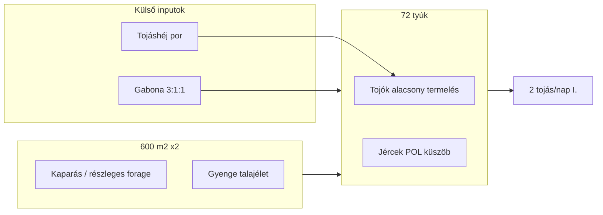

# I. fázis — A jelenlegi rendszer feltárása

## 1. Probléma meghatározása

Két elkülönített **őshonos magyar, vegyes hasznosítású** állomány **~600 m²** területen, fő takarmány **3:1:1 triticale–kukorica–napraforgó**, napi gondozás **~15 perc**. Cél: **tojástermelés növelése**, **gabona-függőség csökkentése**, egész éves **bio/ökologikus** rendszer, **~15 perc/nap** munkakeret, darálás nélkül (keverés OK).

**Jelenlegi termelés:** I. állomány ~**2 tojás/nap** (20 tojó); II. gyakorlatilag **nem indult**. Költözés miatt az I. alacsony termelés **külön okvizsgálat nélkül** marad — ez a dokumentum a **rendszer szerkezetét** írja le.

## 2. Állományok

### Első állomány

| Adat | Érték |
|------|--------|
| Létszám | 22 (20 tojó, 2 kakas) |
| Kor | ~1,5 év |
| Típusok | Vegyes (kopasznyakú, barna, fehér, kendermagos stb.) |
| Terület | ~600 m² (korábban ~30 m²) |
| Tojás | Legfeljebb ~2/nap |

### Második állomány

| Adat | Érték |
|------|--------|
| Létszám | 50 |
| Kor | ~6 hónap |
| Eredeti nemek | ~⅓ kakas, ~⅔ jérce |
| Vágás | ~10 kakas ~1 hónapon belül |
| Cél | Maradék tojótermelésre |
| Terület | ~600 m² (korábban ~30 m²) |
| Tojás | Max. 1–2 eddig |

### Genetikai elvárás (irodalom — nem egyedi mérési adat)

- Tollas őshonos fajták: gyakran **~140–150 tojás/év/tojó**, **~50–55 g** tojás ([PLOS One](https://journals.plos.org/plosone/article?id=10.1371/journal.pone.0238849)).
- Szezonális, természetes fény mellett; egyes leírások szerint **télen is tojnak**, de nem ipari szinten ([Backyard Poultry — Hungarian Yellow](https://backyardpoultry.iamcountryside.com/chickens-101/hungarian-yellow-chickens-2/)).
- Kopasznyakú típusok irodalmi adatai **gyengébbek** — vegyes I. állománynál **bizonytalanság**.

### Csoportok eltérő igényei (logika)

| Csoport | Profil |
|---------|--------|
| I. 20 tojó | Layer: energia + fehérje/AA + **Ca** (termelésfüggő) |
| I. 2 kakas | Karbantartás + kevesebb Ca/tojás |
| II. ~10 vágandó kakas | Finisher/hízás: magas ME, ~16–18% CP |
| II. ~33 jérce (becslés) | Point-of-lay (~6 hó): developer → layer átmenet |
| II. maradó kakasok | Karbantartás / verseny a jércekkel |

Részletes számok: [takarmany-szamitasok.md](./takarmany-szamitasok.md).

## 3. Takarmányozás (jelenlegi)

- **3:1:1** triticale : kukorica : napraforgó; **búza** nem megy bele.
- Előre keverve, porciózva; **onetető** lehetséges (használat ismeretlen).
- **Nincs** külön mész; **tojáshéj** összegyűjtve, darálva/porítva visszaadva.
- **Nincs** említett vitamin–ásvány premix.

**Tápanyagprofil és NRC-összevetés:** [takarmany-szamitasok.md](./takarmany-szamitasok.md).

**I. fázis következtetés (takarmány):** Energiadús, fehérje- és Ca-szegény keverék; **20% napraforgó** tojóprofilhoz **magas**; egy keverék **minden korosztálynak** (II. fiatalok + vágandók).

## 4. Tartási környezet és területhasználat

| Mutató | I. (22 db) | II. (50 db) |
|--------|------------|-------------|
| m² / tyúk | ~27 | ~12 |

EU-szerű organikus kifutó minimum (~4 m²/tyúk) **teljesül**. A korábbi **~30 m²** **extrém szűk** volt; a **600 m²** javíthat viselkedést és terhelés-eloszlást, de **nem pótolja** a layer takarmányt.

**Környezet:** lapos terület, **15–20%** rézsűk, részben akác/erdős jelleg, **gyenge talajélet**, lösz/agyag, sárga talaj. További elkerített területek **használhatók** (rotáció lehetséges — jelenleg nem része a rendszernek).

**Permakultúra megfigyelés:** Nagy terület + gyenge talajélet → a tyúk főleg **vásárolt gabonából** él; a táj **legelő-produkció** alul van integrálva.

## 5. Munka és működés

| Korlát | Érték |
|--------|--------|
| Napi munka | ~15 perc |
| Darálás | Nem kívánt |
| Keverés | OK |
| Vetés | Szokás; **~havi 1** rendszeres vetés elfogadható |

## 6. Szezonális helyzet (kutatás: szeptember vége)

| Időszak | Természetes táplálék | Követelmény |
|---------|---------------------|-------------|
| Aktív növényzet (szept–okt) | Részben van (rovar, mag, zöld) | Forage **kiegészít**, nem garantált fő ration |
| Átmenet (nov–feb) | Erősen csökken | Tárolt takarmány + strukturált kifutó |
| Tél (fagy+) | Minimális | Teljes ration, Ca, vitamin |

## 7. I. fázis — „Hogyan működik ténylegesen?”

**Összegzés:** Nagy kifutó + **energiadús, fehérje-szegény gabona** + **Ca főleg visszanyert tojáshéj** → fenntartásra **elég lehet**, **termelés-növelésre strukturálisan gyenge**. Stressz/költözés **rárakódhat**, de a takarmány–igény eltérés **független kockázat**.
